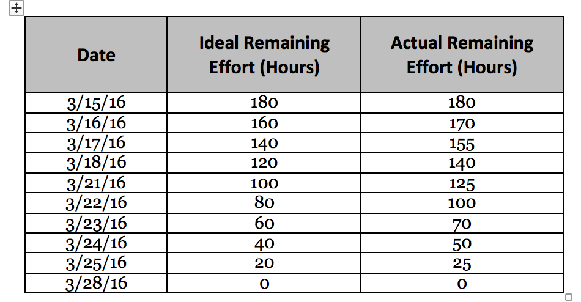
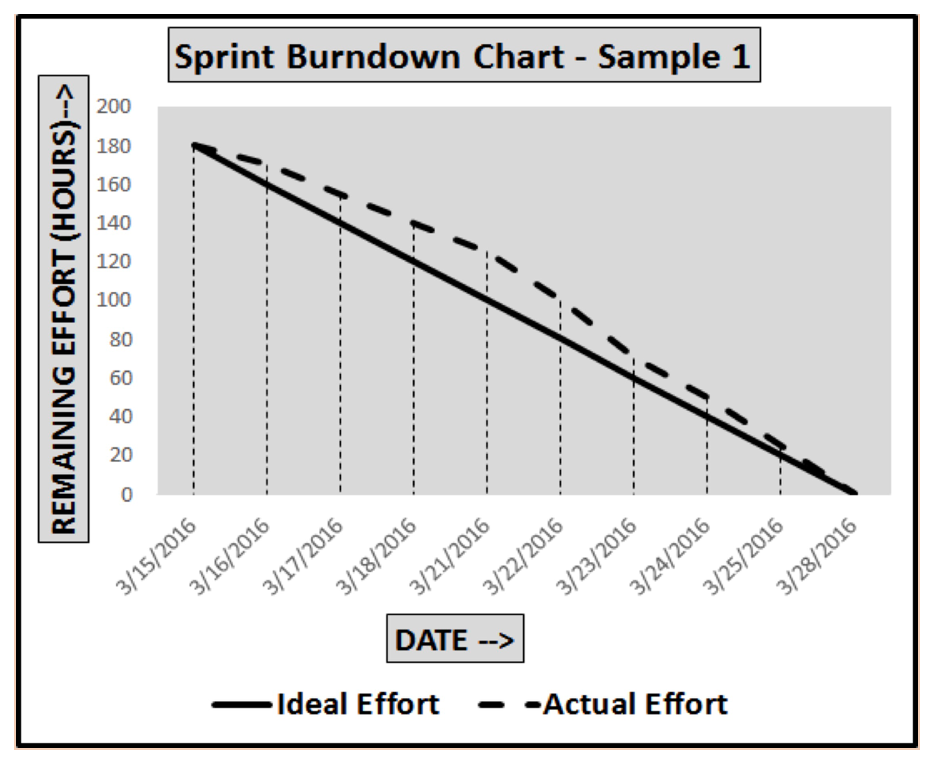

\[siteorigin\_widget class="SiteOrigin\_Widget\_Headline\_Widget"\]\[/siteorigin\_widget\]

The Sprint Burndown or the Iteration Burndown chart is a powerful tool to communicate daily progress to the stakeholders. It tracks the completion of work for a given sprint or an iteration. The horizontal axis represents the days within a Sprint. The vertical axis represents the hours remaining to complete the committed work. The purpose of a sprint burndown chart is to show the total amount of work remaining.

Let's take an example. The below table shows the actual number of hours remaining at the end of each day within a Sprint to create a sample Sprint burndown chart. The table also captures data for ideal remaining hours. The ideal remaining effort is calculated by assuming a uniform rate of task completion each day. In the below example, you can see that the ideal and actual remaining hours were same at the beginning of the sprint, however, as the sprint progresses, the actual remaining hours vary from the ideal remaining hours. 

Next, we will plot a sample Sprint Burndown chart using the above table data. The below diagram depicts the sample chart with ‘Date’ represented on the horizontal axis and ‘Remaining Effort (Hours)’ represented on the vertical axis. 

From the above chart, you can conclude that:

- There were no spillover stories since the actual remaining hours at the end of the sprint were zero.
- The team started a bit slow in the first week of the sprint, but then caught-up during the second week.

### Other articles that you may be interested in:

- [Agile and Lean](https://authoraditiagarwal.com/2019/03/30/agile-lean/)
- [Scrum and Kanban](https://authoraditiagarwal.com/2019/03/30/scrum-kanban/)
- [10 Expert Agile Tips and Techniques](https://authoraditiagarwal.com/2019/02/09/10-expert-agile-tips/)
- [12 Agile Principles](https://authoraditiagarwal.com/2019/02/09/agile-principles/)
- [Sample Kanban Boards](https://authoraditiagarwal.com/2018/10/05/sample-kanban-boards/)

## Learn all about Agile Scrum with my book, [The Basics Of SCRUM](https://www.amazon.com/dp/B07283L1LZ). Other Books:

- [The Basics Of Agile and Lean](https://www.amazon.com/dp/B07P7T78XZ)
- [The Basics Of Kanban](https://www.amazon.com/dp/B07JDZLR62)
- [Enterprise Agility with OKRs](https://www.amazon.com/dp/B07VZ8QNXC)

\[siteorigin\_widget class="WP\_Widget\_Custom\_HTML"\]\[/siteorigin\_widget\]
