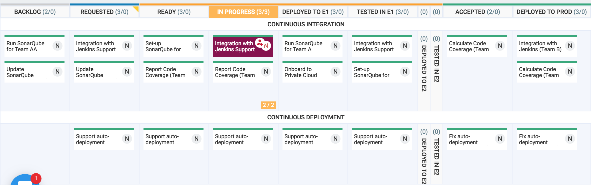
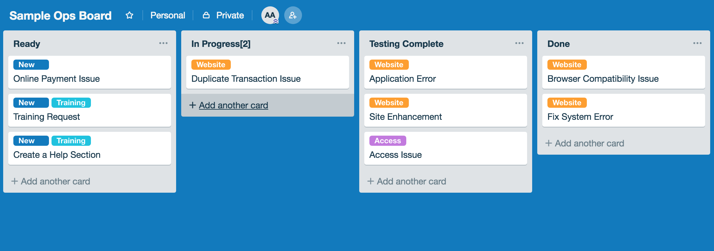
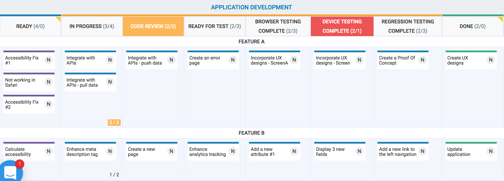
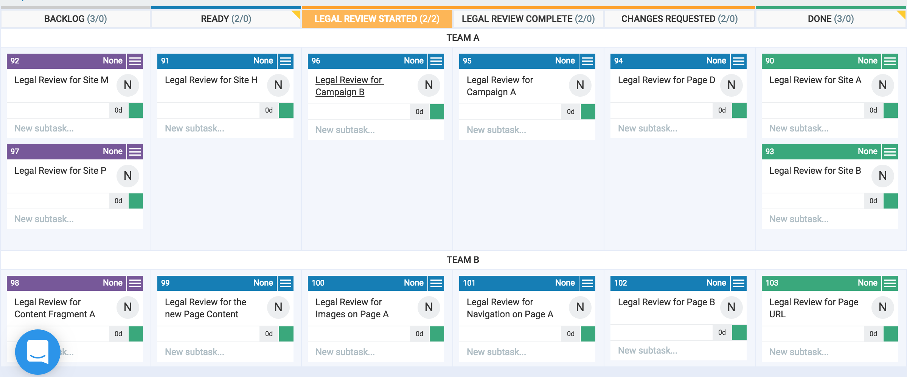
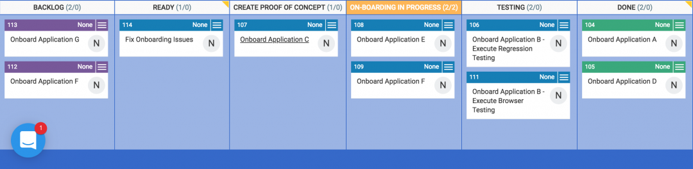
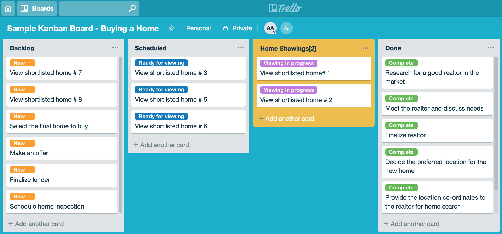
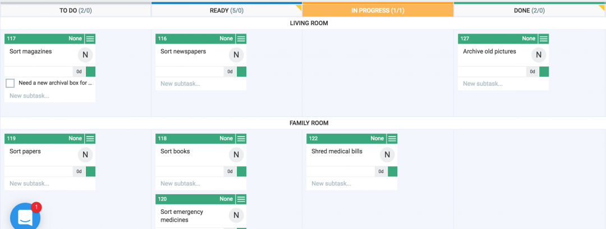

\[siteorigin\_widget class="SiteOrigin\_Widget\_Headline\_Widget"\]\[/siteorigin\_widget\]

What Is a Kanban Board?

A Kanban board is a visual tool for enabling [Kanban](https://authoraditiagarwal.com/2019/03/30/scrum-kanban/) to manage work for any business. The board helps the team to track each of their work items, minimize idle time, improve predictability, increase quality, and reduce time-to-market.

Sample Kanban Boards

Let's dive-in into a few practical examples when teams manage their work via the [Kanban](https://authoraditiagarwal.com/2019/03/30/scrum-kanban/) approach.

Consider a scenario that a DevOps team receives several requests each day to automate build process in Jenkins, resolve test environment issues, onboard new applications onto the hybrid cloud, and so on. Here’s a sample Kanban board for such a scenario.

\[caption id="attachment\_1053" align="aligncenter" width="2364"\] Sample Kanban Board - DevOps\[/caption\]

The second example is of an operations team that receives several calls during the day from its customers and works together to analyze reported issues, provide real-time guidance, and execute fixes to a customer-facing application. Here’s a sample Kanban board for such a scenario.

Next, let's consider a scenario that a software development team receives new requests on a regular basis to build new capabilities and enhance existing application features. This team targets to deliver a quality code and invests time in peer code reviews and application testing. Here’s a sample Kanban board for such a scenario.

Another example is of an organization’s legal team that receives requests on a regular basis from different portfolios in the organization to review content on their sites, campaigns, offers, etc. from a legal point of view. Here’s a sample Kanban board for such a scenario.

Let's take a practical example of a platform team that receives multiple requests from different application teams every day. Here’s a sample Kanban board to visually track their onboarding requests.

One of the examples of a [personal Kanban](https://www.amazon.com/dp/B004R1Q642) board is to track the process when buying a new home. In order to track the various tasks and reduce distractions, you create a Kanban Board with a WIP limit of 2 home viewings. Here’s a sample board for such a scenario. 

Next, let's consider another example of a personal Kanban board. In this scenario, you need to sort your house over the weekend. You decide to organize your work and reduce task-switching by creating a Kanban board. Here’s a sample board for such a scenario. 

> _Now that you have seen a few sample Kanban boards, will you be able to create one for yourself? Share your board in the comments section below. Don't forget to apply a WIP (Work-In-Progress) limit to your board._

_**More articles:**_

- [Agile and Lean Methodologies - Same or Different?](https://authoraditiagarwal.com/2019/03/30/agile-lean/)
- [Expert Agile Tips and Techniques](https://authoraditiagarwal.com/2019/02/09/10-expert-agile-tips/)
- [Scrum and Kanban: Same or Different? Which one is better?](https://authoraditiagarwal.com/2019/03/30/scrum-kanban/)
- [What are the 12 Agile Principles? Learn, Apply, and Be Agile!](https://authoraditiagarwal.com/2019/02/09/agile-principles/)
- [What is a Sprint Burndown Chart? - Agile Scrum Framework](https://authoraditiagarwal.com/2018/04/13/what-is-a-sprint-burndown-chart/)
- [Differences between Waterfall and Agile](https://authoraditiagarwal.com/2018/02/15/waterfall-agile/)
- [5 Habits that Successful Leaders Have](https://authoraditiagarwal.com/2018/04/13/5-habits-that-successful-leaders-have)
- [7 Traits of High-Performing People](https://authoraditiagarwal.com/2018/10/30/7-traits-of-superstars-work/)

_**Other Books on Agile and Lean:**_

- [The Basics Of Agile and Lean](https://www.amazon.com/gp/product/B07P7T78XZ/ref=as_li_tl?ie=UTF8&tag=authoraditi-20&camp=1789&creative=9325&linkCode=as2&creativeASIN=B07P7T78XZ&linkId=77e7553385e328e4c9012e061bf60077)
- [The Basics Of Scrum](https://amzn.to/2TMWqsN)
- [The Basics Of Kanban](https://www.amazon.com/gp/product/B07JDZLR62/ref=as_li_tl?ie=UTF8&camp=1789&creative=9325&creativeASIN=B07JDZLR62&linkCode=as2&tag=authoraditi-20&linkId=c17c9a9b639572b5b2381bbc9fdca34b)
- [Enterprise Agility with OKRs](https://www.amazon.com/dp/B07VZ8QNXC)
