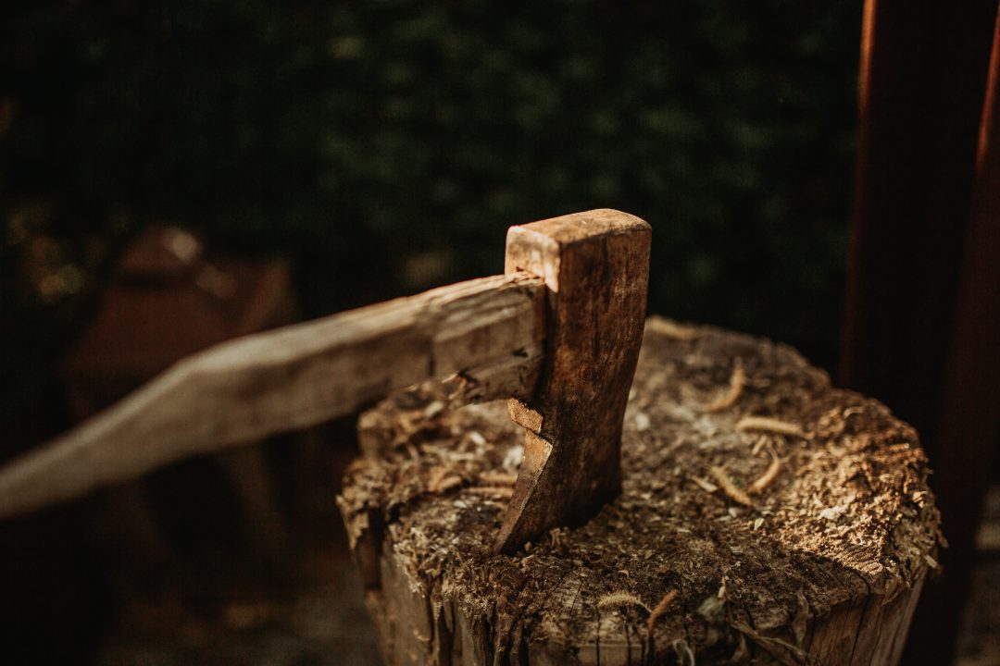

\[siteorigin\_widget class="SiteOrigin\_Widget\_Headline\_Widget"\]\[/siteorigin\_widget\]

> This article covers **10 expert Agile tips and techniques** for your reference. You can use these valuable **insights** to create effective, self-organizing teams. These agile tips are in no particular order, so feel free to skim down the list and read the ones that are most suitable for you.

### **Agile Tip # 1: Discipline**

**Discipline** is the key ingredient in achieving extraordinary results. It brings stability and structure to one’s work or personal life. For instance, it takes discipline to attend scrum ceremonies, meet sprint commitments, and continually learn.

> **_“Discipline is the bridge between goals and accomplishment.” - Jim Rohn_**

### **Agile Tip # 2: Team Collaboration**

In Scrum, the entire development team is responsible to ensure that sprint commitments are met. A team member who has completed his assigned tasks should look to **assist other team members** who need help. In addition, the team should practice empathy towards others, learn new skills, and meets their commitments.

### **Agile Tip # 3: Story Point Estimation**

**Story points** are a relative unit of measure for estimating user stories. A team’s story point estimate should include: 1) the amount of work 2) the complexity of the work 3) any risks or unknowns in doing the work 4) must-have items on your definition of done. 

### **Agile Tip # 4: Splitting User Stories**

**Split your stories** into small stories. In other words, you should resist the temptation to group items together to avoid the management or process overhead. Smaller stories flow better through the sprint. For example, imagine 1,000 marbles working their way down a chute rather than 100 basketballs working their way down the same chute. Therefore, smaller stories are easier to estimate and have less variability than large stories.

### **Agile Tip # 5: Define personas**

**Define personas** for your product and write persona-based user stories. A persona is a fictional character that you create based on your user research to represent different users that might use your product. In conclusion, understanding the characteristics, experiences, behaviors, and needs of your personas will help you to write valuable user stories.

### **Agile Tip # 6: Maximize the business value**

It is important that you understand the **business value** associated with each prioritized user story. 

> _**"Your job isn't to build more software faster; it's to maximize the outcome and impact you get from what you choose to build." -**_ _**Jeff Patton**_

### **Agile Tip # 7: Focus on One Thing**

Are you multitasking or is it context-switching? Research suggests that productivity can be reduced by as much as 40% by the mental blocks created when people switch tasks. Therefore, not only should you work exclusively on what's most important, but you should also look to minimize the number of different things you work on at any given time.

> **_"Extraordinary results are directly determined by how narrow you can make your focus."_ _\- Gary Keller_**

### **Agile Tip # 8: Prioritization**

Product owners should consider both importance and urgency when prioritizing product backlog items for the team. In Scaled Agile Framework (SAFe), WSJF or Weighted Shortest Job First technique is used to sequence jobs and ensure maximum economic benefit. Read more [here](https://www.scaledagileframework.com/wsjf/).

> _**"What is important is seldom urgent, and what is urgent is seldom important."****\- Eisenhower**._

### **Agile Tip # 9: Clean Code**

Write a clean and high-quality code to minimize technical debt.

> **"Anyone can write a code that a computer can understand.** _**Good programmers write code that humans can understand."** **\- Martin Fowler, Author,**_ **and _Programmer_**

### **Agile Tip # 10: Sprint Retrospectives**

Sprint Retrospectives provide explicit opportunities to improve the existing process. In addition, retrospectives promote ownership and responsibility with respect to all aspects of the process. 

> **_"If you adopt only one Agile practice, let it be retrospective. Everything else will follow." - Woody Zuill_**

Also, read these expert Agile tips and techniques on [Medium.](https://medium.com/@authoraditiagarwal/10-expert-tips-in-agile-scrum-6eda49dbad69)

Other **useful blogs** on Agile:

- [94 expert tips for agile teams](https://dzone.com/articles/94-expert-tips-agile-teams)
- [5 agile leadership tips for creating mature scrum teams](https://www.scrum.org/resources/blog/5-agile-leadership-tips-creating-mature-scrum-teams)

[Do you know how Agile is same or different than the Lean methodology?](https://authoraditiagarwal.com/2019/03/30/agile-lean/)

[What's the difference between Scrum and Kanban?](https://authoraditiagarwal.com/2019/03/30/scrum-kanban/)

To learn and practice Agile Scrum, grab my book, **[The Basics Of Scrum](https://www.amazon.com/dp/B07283L1LZ),** from Amazon. 

\[siteorigin\_widget class="SiteOrigin\_Widget\_Button\_Widget"\]\[/siteorigin\_widget\]

\[siteorigin\_widget class="SiteOrigin\_Widget\_Button\_Widget"\]\[/siteorigin\_widget\]
