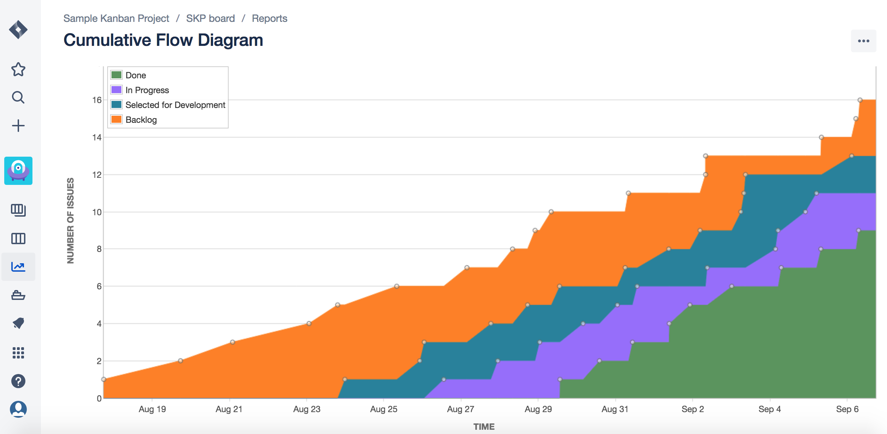
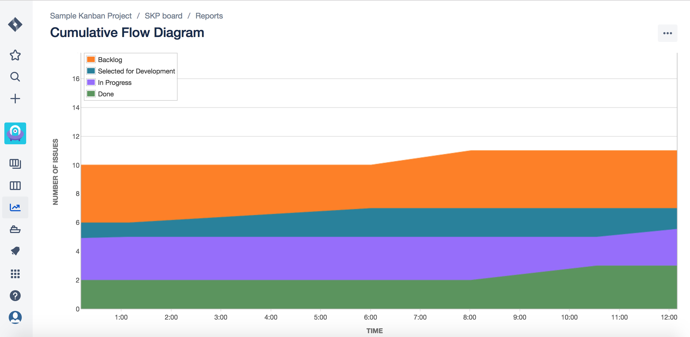
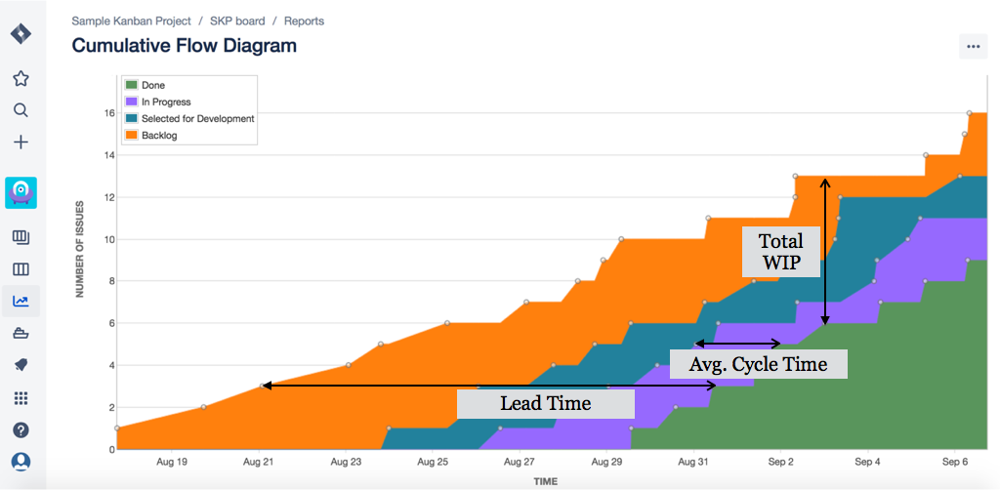

\[siteorigin\_widget class="SiteOrigin\_Widget\_Headline\_Widget"\]\[/siteorigin\_widget\]

\[siteorigin\_widget class="SiteOrigin\_Widget\_Image\_Widget"\]\[/siteorigin\_widget\]

What is Kanban throughput? What's the best way to measure it? This article reflects on these questions and provides a perspective to track a Kanban team's performance in an effective way.

## **What Is Kanban Throughput?** 

Kanban Throughput is defined as the **average number of items or cards** passing through the flow within a **specific time duration** provided that the work load stays uniform during that period. It is generally used to track team's performance. Throughput variability reflects the difference in size, complexity, and team skills.

**According to the Little's Law:**

**Throughput = Total WIP / Average Lead Time**

## **Measuring What Matters: Kanban Throughput**

The best way to measure throughput in Kanban is with the CFD (Commulative Flow Diagram). The Cumulative Flow Diagram is the visual representation of the cards as they move from one column or state to another on a Kanban board. The CFD plots the number of cards at each stage at a given time.

Below is a **sample CFD** for your reference:

The different colors on this diagram represent the various states in the flow. The height of each color band indicates the number of cards in that state at that point in time. 

The CFD provides you with an insight on how many cards moved from one state to another in a specific time duration. Generally, the CFD is plotted for each day, however, if there are too many moving cards in a day, it can be plotted on an hourly basis as well. Below is a sample CFD when plotted for every hour in a working day.

Moreover, the CFD provides valuable data on lead time and cycle time trends. Both lead time and cycle time denote the time a work item spends in the workflow until they are complete. **Lead time** is the time that a card takes from start to finish. **Cycle time** is the time an engineer spends to actively work on it. In a CFD, both lead time and cycle time metrics are measured along the horizontal axis.

The Cumulative Flow Diagram (CFD) also displays total cards across different columns i.e. total WIP. This data is measured along the vertical axis of the CFD diagram.

Below is a sample CFD that depicts lead time, average cycle time, and the total WIP.

_If you are interested about other Kanban charts such as Average Lead Time, Average Cycle Time, Flow Efficiency Chart, or the Blocker Clustering Chart, read my book, [The Basics Of Kanban - A Popular Lean Framework.](https://www.amazon.com/dp/B07JDZLR62)_

_**You may also be interested in these articles...**_

- [Enterprise Agility - Expectations Vs Reality](https://authoraditiagarwal.com/2019/11/09/enterprise-agility-expectations-reality/)
- [The Future Of Agile](https://authoraditiagarwal.com/2019/11/23/the-future-of-agile/)
- [Will OKRs Rule The World?](https://authoraditiagarwal.com/2019/12/18/will-okrs-rule-the-world/)
- [Agile and Lean Methodologies - Same or Different?](https://authoraditiagarwal.com/2019/03/30/agile-lean/)
- [Expert Agile Tips and Techniques](https://authoraditiagarwal.com/2019/02/09/10-expert-agile-tips/)
- [Scrum and Kanban: Same or Different? Which one is better?](https://authoraditiagarwal.com/2019/03/30/scrum-kanban/)
- [What are the 12 Agile Principles? Learn, Apply, and Be Agile!](https://authoraditiagarwal.com/2019/02/09/agile-principles/)
- [What is a Sprint Burndown Chart? - Agile Scrum Framework](https://authoraditiagarwal.com/2018/04/13/what-is-a-sprint-burndown-chart/)
- [Differences between Waterfall and Agile](https://authoraditiagarwal.com/2018/02/15/waterfall-agile/)
- [5 Habits that Successful Leaders Have](https://authoraditiagarwal.com/2018/04/13/5-habits-that-successful-leaders-have)
- [7 Traits of High-Performing People](https://authoraditiagarwal.com/2018/10/30/7-traits-of-superstars-work/)

_**...and below books on Agile and Lean:**_

- [Enterprise Agility with OKRs](https://www.amazon.com/dp/B07VZ8QNXC)
- [The Basics Of Agile and Lean](https://www.amazon.com/gp/product/B07P7T78XZ/ref=as_li_tl?ie=UTF8&tag=authoraditi-20&camp=1789&creative=9325&linkCode=as2&creativeASIN=B07P7T78XZ&linkId=77e7553385e328e4c9012e061bf60077)
- [The Basics Of Scrum](https://amzn.to/2TMWqsN)
- [The Basics Of Kanban](https://www.amazon.com/gp/product/B07JDZLR62/ref=as_li_tl?ie=UTF8&camp=1789&creative=9325&creativeASIN=B07JDZLR62&linkCode=as2&tag=authoraditi-20&linkId=c17c9a9b639572b5b2381bbc9fdca34b)
