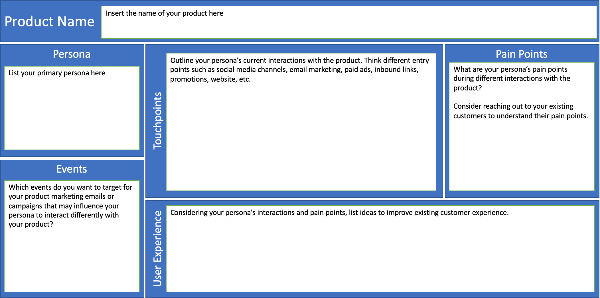
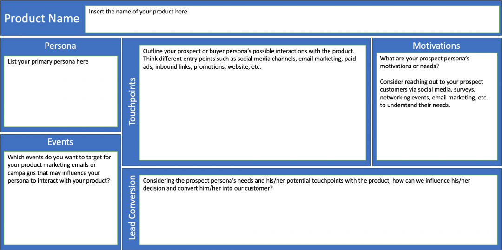

\[siteorigin\_widget class="SiteOrigin\_Widget\_Headline\_Widget"\]\[/siteorigin\_widget\]

\[siteorigin\_widget class="SiteOrigin\_Widget\_Image\_Widget"\]\[/siteorigin\_widget\]

In this article, let me introduce you to the Customer Journey Map template I have designed. This template will simplify the data gathering and visualization of required data attributes such as your persona's needs or motivations, important events, touchpoints, and actions. But first, let's start with the definition.

### What is Customer Journey Mapping?

Customer journey mapping is the process of creating a customer journey map, which is a **visual representation of your customer’s or prospect’s interactions with your product.** This strategic exercise helps to think from customers’ or prospects’ perspectives and **better understand their expectations, pain points, motivations, and needs. The journey map** maps out all touchpoints from the first to the final touchpoint for both your existing and potential customers and is leveraged to visualize and improve the overall customer onboarding and experience.

### How to create a Customer Journey Map?

- Define primary and secondary personas for your product

> _A persona is a character profile or a fictional character. Personas help to understand the needs, experiences, behaviors, and goals of your users. If you want to create personas for your product, you may listen to my lecture in the [online course](https://www.udemy.com/course/agile-product-planning/?referralCode=09701186A5D469765D2B)._

- Outline key events, persona's needs, and possible interactions with your product across different traffic sources
- Create a comprehensive visual diagram that describes the journey of your primary and secondary personas

> _There are multiple visual tools that are available to create the journey diagram such as [Mural](https://www.mural.co/), Gliffy, [UXPressia](https://uxpressia.com/), [Lucidchart](https://www.lucidchart.com/pages/), Microsoft Visio, OmniGraffle, [Miro](https://miro.com/), etc._

For outlining the required data in Step#2, I created the Customer Journey Map Template or a Canvas as below:

### Customer Journey Map Template for an Existing Customer

> _Enroll in the [online course](https://www.udemy.com/course/agile-product-planning/?referralCode=09701186A5D469765D2B) to download this canvas and learn more ->_
> 
> _[**Agile Product Planning: Discovery, Vision, Strategy, Roadmap** - Create Business Models, Personas, Product Vision, Customer Journey Maps, Roadmap, and Product Backlog](https://www.udemy.com/course/agile-product-planning/?referralCode=09701186A5D469765D2B)_

### Customer Journey Map Template for a Prospective Customer

> _Enroll in the [online course](https://www.udemy.com/course/agile-product-planning/?referralCode=09701186A5D469765D2B) to download this canvas and learn more ->_
> 
> _[**Agile Product Planning: Discovery, Vision, Strategy, Roadmap** - Create Business Models, Personas, Product Vision, Customer Journey Maps, Roadmap, and Product Backlog](https://www.udemy.com/course/agile-product-planning/?referralCode=09701186A5D469765D2B)_

> ### _[Watch the Customer Journey Mapping Lecture Here!](https://www.youtube.com/watch?v=3IzTwsi0P8M)_

<!--more-->

**_You may be interested in my published courses and books as outlined below:_** 

- **_Courses:_**
    - [_Agile Product Planning: Discovery, Vision, Strategy, Roadmap_](https://www.udemy.com/course/agile-product-planning/?referralCode=09701186A5D469765D2B)
    - [_Lean-Agile Leadership: The Foundation Of Enterprise Agility_](https://www.udemy.com/course/lean-agile-leadership/?referralCode=E39C903CE55D83496C49)
    - [_Agile Metrics: Elevate Team Agility with Scrum Reporting_](https://www.udemy.com/course/agile-metrics/?referralCode=A5DC6DBE045522B7C618)
    - [_Applying Scrum: Mastering Agile Project Management w/ Scrum_](https://www.udemy.com/course/applying-scrum/?referralCode=072919E3B0D39A029648)
- **_Books:_**
    - _[Enterprise Agility with OKRs](https://www.amazon.com/dp/B07VZ8QNXC)_
    - _[The Basics Of Agile and Lean](https://www.amazon.com/gp/product/B07P7T78XZ/ref=as_li_tl?ie=UTF8&tag=authoraditi-20&camp=1789&creative=9325&linkCode=as2&creativeASIN=B07P7T78XZ&linkId=77e7553385e328e4c9012e061bf60077)_
    - _[The Basics Of Scrum](https://amzn.to/2TMWqsN)_
    - _[The Basics Of Kanban](https://www.amazon.com/gp/product/B07JDZLR62/ref=as_li_tl?ie=UTF8&camp=1789&creative=9325&creativeASIN=B07JDZLR62&linkCode=as2&tag=authoraditi-20&linkId=c17c9a9b639572b5b2381bbc9fdca34b)_

_**You may also be interested in these articles...**_

- - [_Agile Anti-Patterns For Remote Teams_](https://authoraditiagarwal.com/2020/06/17/agile-anti-patterns-for-remote-teams/)
    - _[Virtual PI Planning](https://authoraditiagarwal.com/2020/03/16/virtual-pi-planning/)_
    - _[Leadership Agility: What You Need to Know](https://authoraditiagarwal.com/2020/02/03/leadership-agility/)_
    - _[Will OKRs Rule the World?](https://authoraditiagarwal.com/2019/12/18/will-okrs-rule-the-world/)_
    - _[Enterprise Agility - Expectations Vs Reality](https://authoraditiagarwal.com/2019/11/09/enterprise-agility-expectations-reality/)_
    - _[Agile and Lean Methodologies - Same or Different?](https://authoraditiagarwal.com/2019/03/30/agile-lean/)_
    - _[Expert Agile Tips and Techniques](https://authoraditiagarwal.com/2019/02/09/10-expert-agile-tips/)_
    - _[Scrum and Kanban: Same or Different? Which one is better?](https://authoraditiagarwal.com/2019/03/30/scrum-kanban/)_
    - _[How to Measure Kanban Throughput?](https://authoraditiagarwal.com/2019/12/19/measure-kanban-throughput/)_
    - _[What are the 12 Agile Principles? Learn, Apply, and Be Agile!](https://authoraditiagarwal.com/2019/02/09/agile-principles/)_
